# Office killer


```{r, echo = FALSE, out.width=200}
library(knitr)
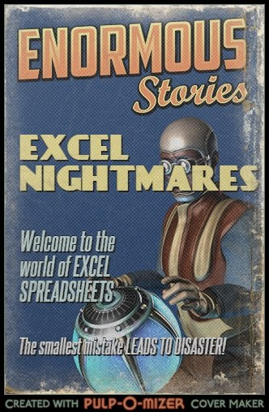
```


- **Mise en place** : Télécharger le [dossier exo2](https://github.com/worldregio/bivaR/raw/main/resources/exos/exo2.zip) et décompressez le sur votre ordinateur. Puis ouvrez le projet R `exo2.Rproj` dans Rstudio.


Le but de ce chapitre est de montrer le plus tôt possible aux étudiants les possibilités de R et de son environnement R-Studio en ce qui concerne la production de documents ou de présentations dans le cadre d'une démarche reproductible. L'apprentissage précoce de **Rmarkdown** nous semble en effet indispensable, ne serait-ce que pour que les étudiants apprennent à prendre en cours des notes mélangeant les exemples de code R et les explications données en cours ou en TD.

Mais le but véritable est de convaincre tout ou partie des étudiants qu'ils peuvent remplacer à terme les logiciels de bureautique des suites office par un environnement de travail plus intégré et plus performant... à condition d'oublier la souris pour revenir au clavier !

> Real mensch never clcik !


## Rstudio et les projets R

>- Au commencement, les dieux de la statistique créèrent le langage R.
>- Mais l'interface était vide et vague, 
>- les ténèbres couvraient les lignes de code
>- R-Studio dit : Que le projet soit et le projet fut. 


Si l'on veut s'épargner bien des désagréments dans l'apprentissage de R, il faut prendre dès le départ de bonnes habitudes. Parmi celles-ci, l'une des plus importantes est le fait d'inscrire toujours son travail dans le cadre d'un **projet R** c'est-à-dire - en simplifiant beaucoup - un **répertoire de travail** contenant l'ensemble des données, programmes, résultats... que l'on pourra par la suite compresser, archiver et transmettre à quelqu'un d'autre. 

### Lancement de R studio

Sauf à être complètement masochiste, on n'utilise jamais **R** directement mais on lance d'abord l'interface **R-Studio** qui facilite conisdérablement l'ensemble des opérations et offre une gamme considérable de services. Il ne faut toutefois pas confondre les deux et il serait par exemple ridicule d'indiquer sur un CV en vue d'un emploi de statisticien que l'on sait utiliser R-studio en oubliant de préciser que l'on maîtrise R. 


### Création d'un projet 

Pour créer un projet on utilise le menus déroulant *File/new project/ ...* et on définit un dossier de notre ordinateur (existant ou à créer) qui contiendra le projet. Une fois l'opération effectuée, on pourra constater que ce dossier contient un fichier *xxx.Rproj* ou xxx est en principe le nom du dossier dans lequel vous avez stocké le projet.

Ce fichier contient toute une série d'informations dont nous ne parlerons pas dans ce cours d'initiation mais qui, pour faire simple, définissent un ensemble de réglages du logiciel et de préférences de l'utilisateur. 

Si vous fermez Rstudio (faites-le !) il vous suffira pour reprendre votre travail là où vous vous étiez arrêté :

- de lancer R-studio et de cliquer sur *File/open project/...* suivi du nom du fichier xxx.Rproj
- ou plus simplement encore de double cliquer sur le fichier xxx.Rproj ce qui lancera automatiquement Rstudio

Le dossier contenant votre projet R peut être organisé à votre convenance. Certains mettent tout les fichier pêle-mêle dans le dossier. D'autres préfèrent créer des sous-dossiers contenant des données, des programmes, des résultats, des figures. Vous déciderez à l'usage de ce qui vous convient le mieux, mais le point important est que **tout ce qui entre ou sort de vos programmes R doit être de préférence stocké dans le répertoire du projet**. 

```{r, echo = FALSE}
knitr::include_graphics("resources/figures/monprojet.png")
```


## Programme R : Excel killer ?

>- C'est pourquoi tu quittera Word et Excel, et t'attachera à R studio,
>- et vous deviendrez une seule chair. 


La fonction initiale d'un langage de programmation comme R est ... de créer des **programmes** c'est-à-dire des ensembles d'instruction permettant d'accomplir une tâche à l'intérieur d'une chaîne de production. Dans le cas d'un logiciel spécialisé dans l'analyse statistique, il s'agira donc de partir de données (statistiques, géographiques, textuelles, ...) pour aboutir à des résultats prenant la forme de tableaux, cartes ou graphiques. Il ne s'agit donc en somme que d'une étape du travail de recherche où le principal avantage de R est d'**automatiser une tâche** et de faciliter sa **reproduction ultérieure** avec en arrière plan un objectif de **productivité** puisque l'ordinateur réalise en quelques millisecondes des tâches qui prendraient des heures avec un logiciel click-bouton de type Excel. 


```{r, echo = FALSE, out.width="800px"}
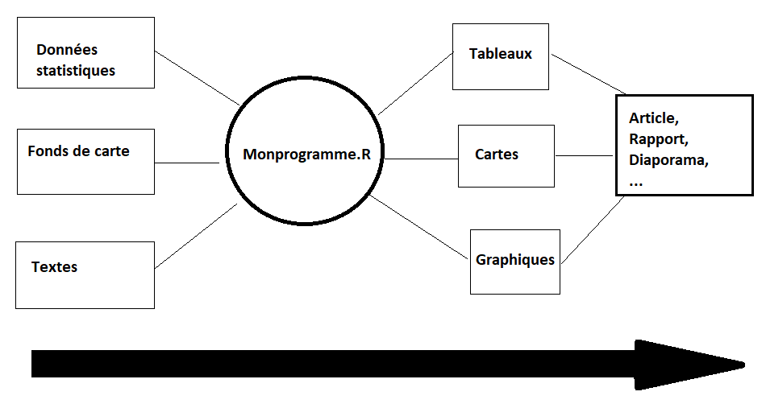
```


Prenons comme exemple le cas d'un éditeur qui souhaite réaliser une grande encyclopédie des jeux olympiques. Il a besoin pour cela d'embaucher un **data analyst** qui l'aidera à exploiter une grande base de données qu'il a trouvé sur internet, intitulée [120 years of olympic history, athlets and results](https://www.kaggle.com/datasets/heesoo37/120-years-of-olympic-history-athletes-and-results)

Deux candidats se présentent pour le poste :

- **Le candidat A** est un expert dans la manipulation du package office (Excel, Word, Power Point, ...) avec plus de 30 ans d'expérience. 
- **Le candidat B** est un étudiant de Master 1 ayant suivi un semestre de formation à R et Rstudio.

L'éditeur décide de les mettre en concurrence pour voir lequel des deux candidats est le plus efficace et prépare une série d'épreuves qui seront chronométrées

### Round 1 : Importation du tableau de données 

Il faut importer le tableau, déterminer le nombre de lignes et de colonnes puis afficher les 5 premières et 5 dernières lignes


On crée un programme R avec *File/New File/R Script* puis on l'enregistre avec *File/Save/ ...* suivi du nom du programme.

```{r}
# Importation du tableau
don <- read.table(file = "resources/data/olympic/120-years-of-olympic-history-athletes-and-results.csv",
                  header= TRUE,
                  sep =",")

# détermination du nombre de lignes et de colonnes
dim(don)

# affichage des 5 premières lignes
head(don,5)

# Affichage du tableau
tail(don,5)
```


Normalement, les étudiants qui utilisent un tableur ont du aller plus vite et Excel mène sur R par 1-0


### Round 2. Inventaire des sports disponible

On souhaite faire l'inventaire de l'ensemble des sports disponibles dans la base de données.  Puis créer un tableau indiquant les 10 sports sur lesquels on dispose du plus grand nombre d'information.

```{r olymp2}
# Création d'une table
tab<-table(don$Sport)
class(tab)

# Transformation de la table en data.frame
res<-data.frame(tab)

# Recodage des noms de variables
names(res)<-c("Sport","Nbresul")

# Tri du tableau
res<-res[order(-res$Nbresul),]


# Affichage de res
head(res, 20)

```


La création d'un tableau est à première vue plus facile avec un logiciel click-bouton. L'expert en Excel va utiliser la fonction tableau croisé dynamique et produire le tableau en quelques secondes. Il devrait par contre perdre un peu de temps pour trier le tableau mais finir par l'emporter.
Excel mène 2-0.


### Round 3. Sélection d'un sport

Vous devez maintenant extraire le tableau des résultats de tir à l'arc ("*Archery*") après 1990 en ne conservant que les personnes qui ont obtenu une médaille.

```{r}

# sélection
sel <- don[don$Year > 1990 & don$Sport=="Archery" & is.na(don$Medal)==FALSE,]

# Affichage
head(sel)
```

Là, je parie que les utilisateurs d'Excel ont eu un peu plus de mal ... mais on va supposer qu'il y a match nul : Excel = 3, R = 1


### Round 4. Analyse de l'âge, du poids, de la taille et de l'IMC des sportifs

Résumez statistiquement, l'âge, le poids, la taille et l'Indice de Masse Corporelle (IMC = Poids en kg/ carré de la taille en mètres ) des personnes ayant obtenu une médaille en séparant les hommes et les femmes.

```{r}
tapply(sel$Age, 
       INDEX = sel$Sex,
       FUN="summary")


tapply(sel$Height, 
       INDEX = sel$Sex,
       FUN="summary")

tapply(sel$Weight,
       INDEX=sel$Sex,
       FUN="summary")

sel$IMC <- sel$Weight/(sel$Height/100)**2

tapply(sel$IMC,
       INDEX=sel$Sex,
       FUN="summary")
```

Quelque chose me dit qu'Excel a eu un peu de mal à résoudre le problème. Le score est désormais
de 3-2


### Round 5 : Nombre de médailles d'or par pays et par épreuve

On cherche maintenant à déterminer le nombre de médailles par pays et par épreuve. Attention, dans le cas des épreuves par équipe il ne faut compter les membres d'une équipe qu'une seule fois ...

```{r}
# Sélection des lignes  (médailles d'or)
sel2 <- sel[sel$Medal=="Gold",]

# Selection des colonnes 
sel3 <- sel2[,c("NOC","Year","Event")]

# Elimination des doublons
sel4 <-unique(sel3)

# Tableau croisé
tab<-table(sel4$Event,sel4$NOC)

# Tri des pays ayant le plus de médailles


# Ajout des marges
addmargins(tab)

```

Quelque chose me dit qu'Excel a eu un beaucoup de mal à résoudre le problème. Le score est désormais
de 3-3


### Dernier round. Refaire toute l'analyse en changeant de sport

On remplace le sport "Archery" par le sport "Judo" et on refait toute les analyses

```{r carte003}
# (1) Importation du tableau
don <- read.table(file = "resources/data/olympic/120-years-of-olympic-history-athletes-and-results.csv",
                  header= TRUE,
                  sep =",")

# (2) Sélection du sport et de la data
sel <- don[don$Year > 1990 & don$Sport=="Judo" & is.na(don$Medal)==FALSE,]

# (3) Caractéristiques des sportifs
tapply(sel$Age, 
       INDEX = sel$Sex,
       FUN="summary")

tapply(sel$Height, 
       INDEX = sel$Sex,
       FUN="summary")

tapply(sel$Weight,
       INDEX=sel$Sex,
       FUN="summary")

sel$IMC <- sel$Weight/(sel$Height/100)**2

tapply(sel$IMC,
       INDEX=sel$Sex,
       FUN="summary")

# (4) Médailles d'or par pays et épreuve

# Sélection des lignes  (médailles d'or)
sel2 <- sel[sel$Medal=="Gold",]

# Selection des colonnes 
sel3 <- sel2[,c("NOC","Year","Event")]

# Elimination des doublons
sel4 <-unique(sel3)

# Tableau croisé
tab<-table(sel4$Event,sel4$NOC)

# Ajout des marges
addmargins(tab)

```

Excel n'a aucune chance d'aller plus vite et R remporte le match par KO !


## Document Rmd : Word killer ?


>- R-Studio dit : « Faisons une interface de rédaction adaptée à notre travail, 
>- Que l'utilisateur puissent y insérer les tableaux, les graphiques, les cartes, les références bibliographiques, et tous les écrits qui les commentent. »


Nous venons de voir comment une bonne pratique de R peut conduire progressivement à abandonner l'usage des tableurs (Excel, Open Office) sauf peut-être pour l'étape de saisie des données. Dès lors qu'il s'agit de réaliser des graphiques ou des calculs statistiques complexes, la rédaction d'un programme se révèle beaucoup plus intéressante même si elle impose un coût initial d'apprentissage.

Mais une bonne pratique de R ou plus précisément des documents  R markdown peut vous conduire beaucoup plus loin et vous amener à abandonner également votre logiciel de traitement de texte (Word) et votre outil de présentation (Power Point). Le coût d'apprentissage est naturellement un peu plus élevé mais les bénéfices sont à la mesure de l'investissement.

Comme le montre la figure ci-dessous, un document R markdown est en quelques sorte un mélange entre des lignes de code R qui executent des tâches et des lignes de texte où sont expliqués les calculs et commentés les résultats obtenus. En d'autres termes, un document R markdown vous permet de rédiger un article de recherche complet, une présentation à une conférence, un syllabus de cours, dans un seul environnement logiciel (R studio). 

Nul besoin de ciseau et de colle pour aller chercher tel tableau ici, tel figure là-bas ou telle carte ailleurs. Tous ces éléments sont intégrs au fur et à mesure de la rédaction ce qui facilite considérablement la concentration. Et surtout - on l'a déjà vu pour le programme R - le document peut facilement être reproduit ou mise à jour sans être obligé de réplique des dizaines de click de souris.   


```{r echo=FALSE, out.width="800px"}
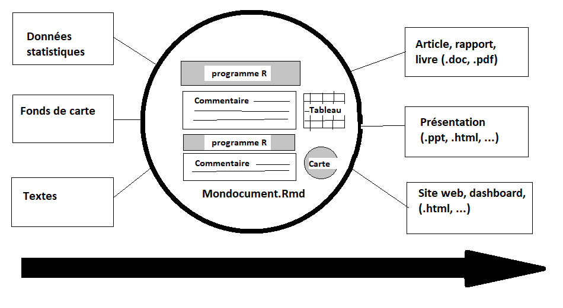
```


On va supposer que l'on veut rédiger une fiche de synthèse d'une page sur une épreuve sportive comportant un tableau, un graphique et une carte  


### Préparation du document Rmarkdown

On commence par rassembler dans un dossier les données dont nous aurons besoin et on les stocke dans des sous-dossiers. Dans l'exemple ci-dessous on a créé un dossier appelé `olympic` avec un sous-dossier `data` pour les tableaux statistiques, un dossier `img` pour les photographies et un dossier `map` pour les fonds de carte. Une fois que cela est fait, on crée un projet R dans le dossier ce qui entraîne la création du fichier `olympic.Rproj'.

```{r, echo=FALSE, out.width="400px"}
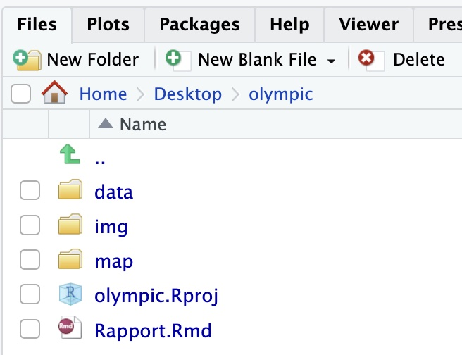
```


A l'intérieur de ce projet, on crée un document de type Rmd (R markdown) auquel on donne le titre "Tir à l'arc" et on le sauvegarde sous le nom `Rapport.Rmd`.


```{r, echo=FALSE, out.width="400px"}
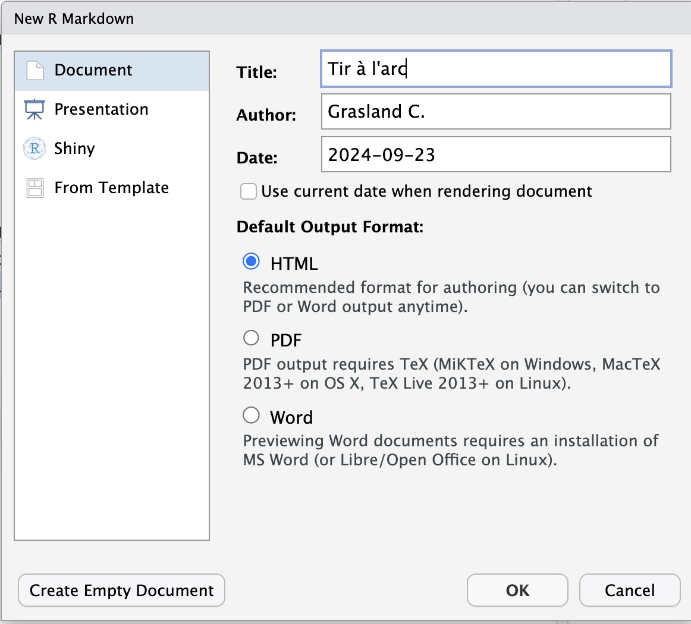
```

### Préparation du plan

Au moment de l'ouverture, le document ressemble à ceci: 

```{r, echo=FALSE, out.width="700px"}
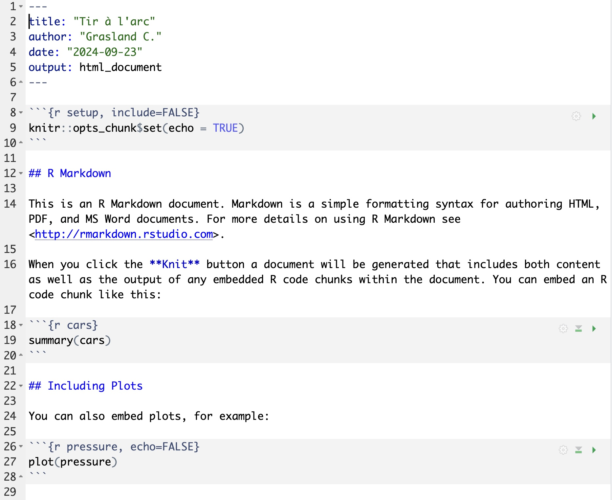
```

On garde le premier bloc de programme (en gris) et on élimine toute la partie créée par Rstudio pour servir d'exemple. On la remplace par notre plan en utilisant des instructions pour hiérarchiser les parties (`##`) , sous-parties (`###`) et sous-sous parties (`####`). On évitera d'utiliser (`#`) qui correspond à un titre de chapitre ou d'ouvrage.


```{r, echo=FALSE, out.width="700px"}
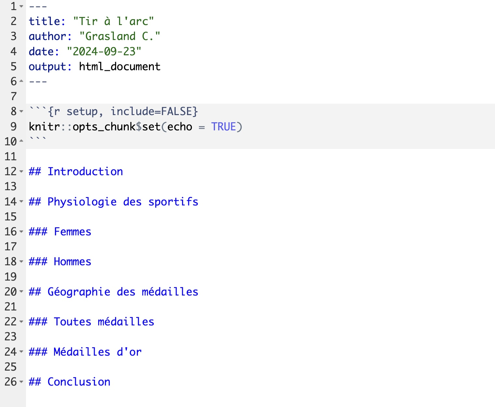
```


On clique alors sur le bouton "Knit" (une pelotte de laine bleue) pour visualiser le résultat qui s'affiche sous la forme d'une page .html.

```{r, echo=FALSE, out.width="400px"}
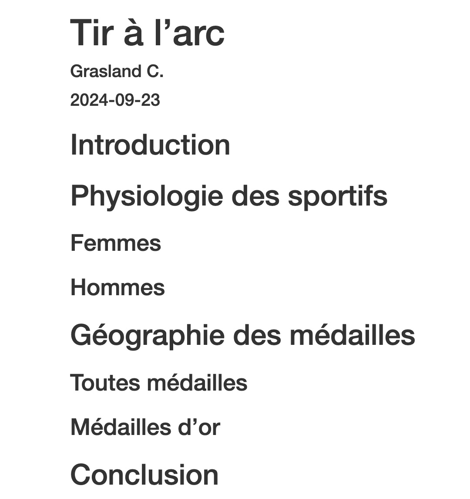
```

### Ajout d'images externes

On décide de placer en tête de notre document une image d'une sportive française ayant obtenu la médaille de bronze au JO de Paris 2024. Il y a deux solution pour cela.  Soit on utilise directement une commande Markdown, soit on crée un bloc de programme. Dans ce cas on utilisera la commande `include_graphics()` du package knitr et l'on précisera les paramètres de l'image dans l'en-tête du bloc de programme. 

```{r, echo=FALSE, out.width="700px"}
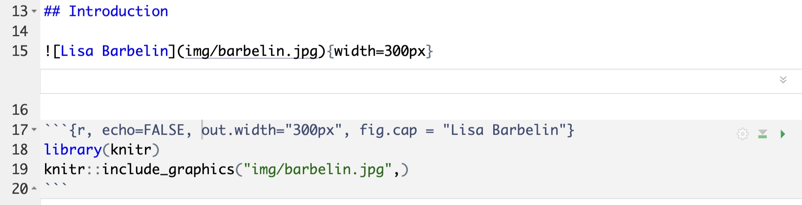
```

Les résultats sont identiques mais la seconde solution est en général préférable car elle permet d'opérer des réglages plus précis, notamment pour les renvois. 


```{r, echo=FALSE, out.width="700px"}
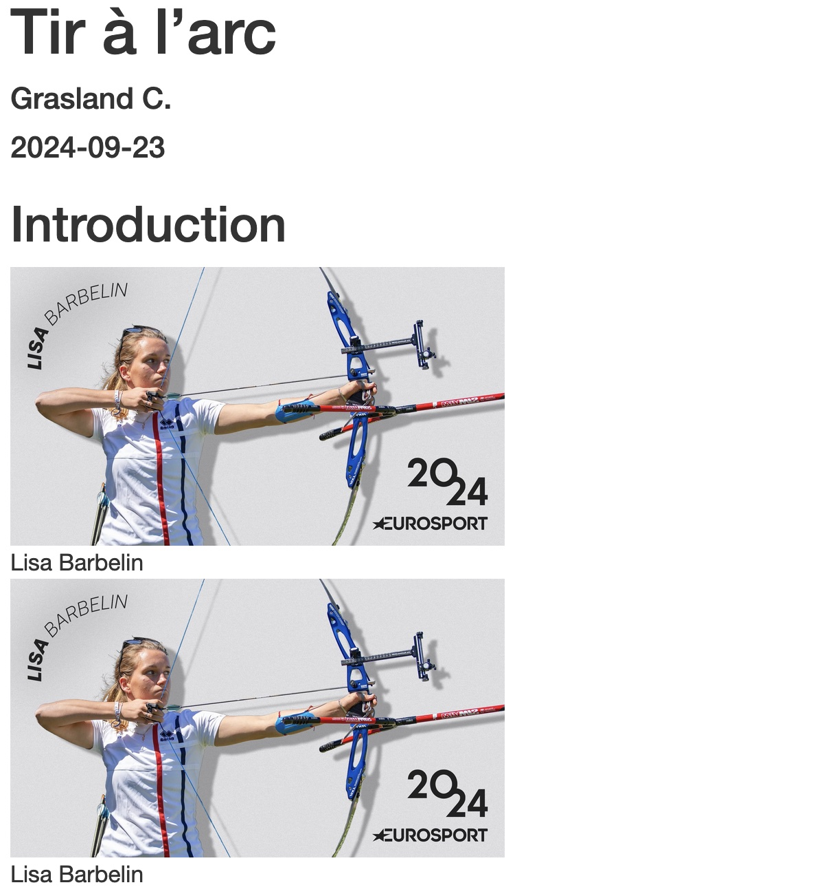
```

 
### Ajout de texte

On rédige l'introduction de la note en tapant du texte et en ajoutant du gras ou de l'italique à l'aide des caractères spéciaux du langage Markdown. Dans l'exemple ci-dessous, on a également introduit un lien web vers une URL et une énumération sous forme de puces.


```{r, echo=FALSE, out.width="700px"}
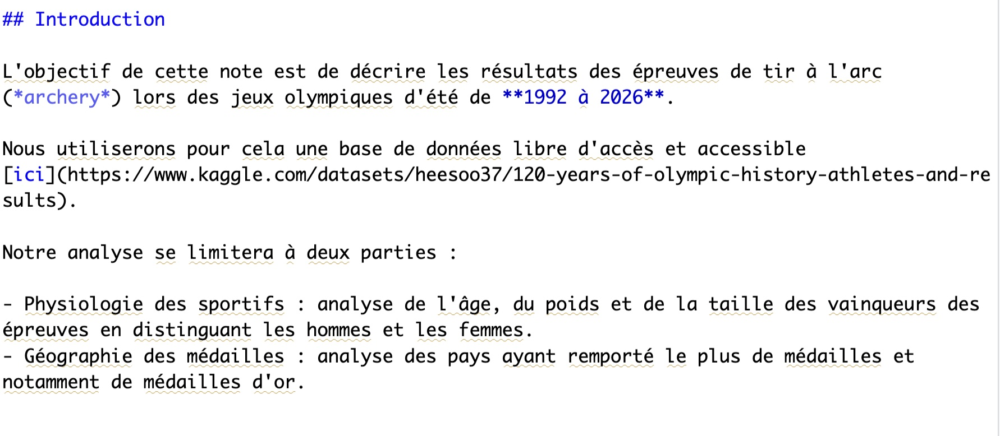
```

Voici le résultat en html une fois que l'on a cliqué sur le bouton  `knit`

```{r, echo=FALSE, out.width="700px"}
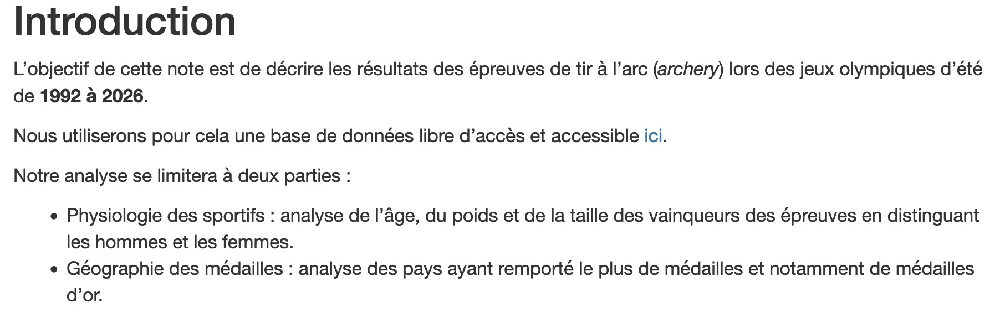
```


### Ajout d'un tableau

On décide d'ajouter un tableau de l'ensemble des femmes qui ont été médaillées dans l'épreuve individuelle de tir à l'arc de 1992 à 2024. Pour que le tableau soit plus joli on va l'afficher avec la commande `kable()` du package `knitr`

```{r, echo=FALSE, out.width="700px"}
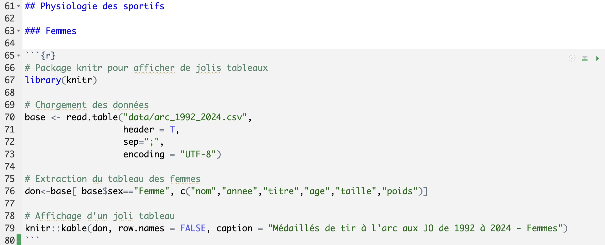
```

Voici le résultat dans la page .html 

```{r, echo=FALSE, out.width="700px"}
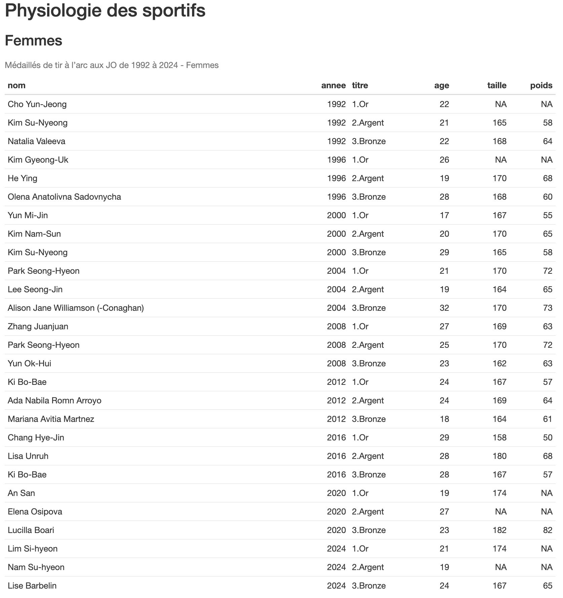
```


### Ajout d'un graphique

On souhaite comparer la taille des hommes et des femmes à l'aide d'une boîte à moustache. On introduit donc dans notre document markdown le bloc de code suivant : 

```{r, echo=FALSE, out.width="700px"}
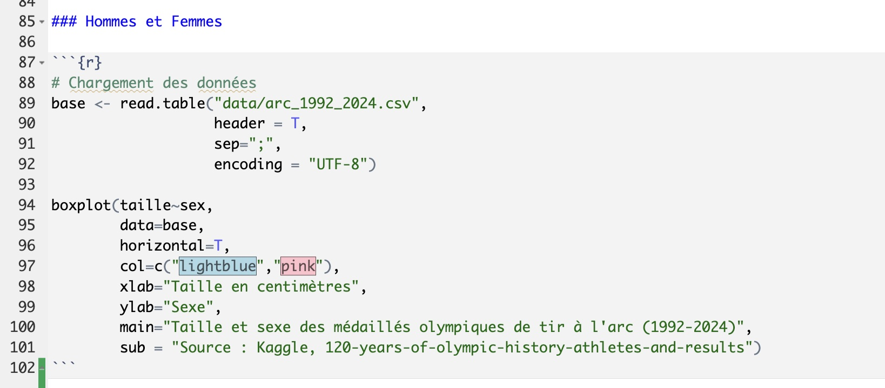
```

Ce qui donne le résultat suivant :

```{r, echo=FALSE, out.width="700px"}
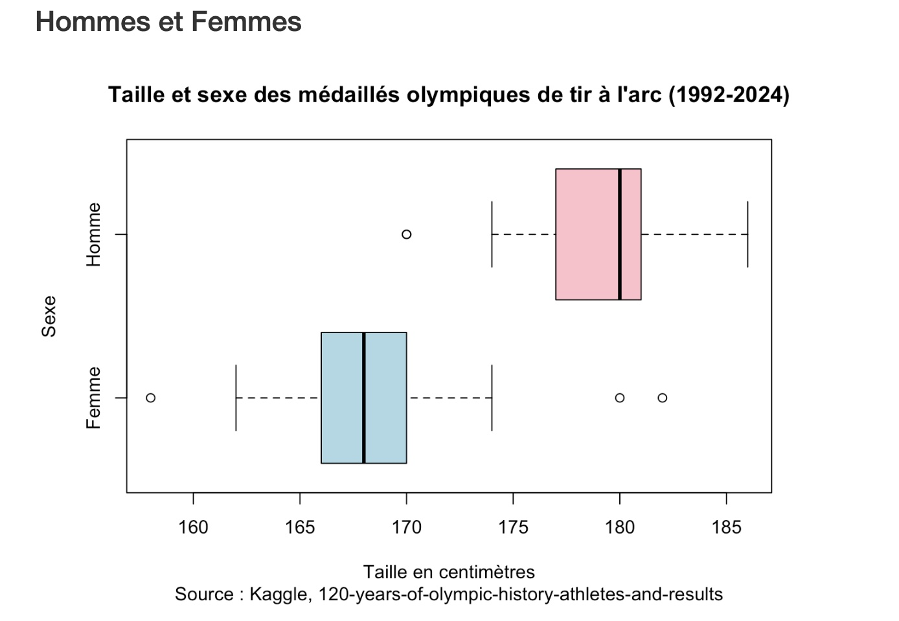
```


### Ajout d'une carte

Supposons pour finir qu'on veuille afficher une carte du Monde indiquant la répartition par pays des médailles du sport considéré. On dispose pour cela d'un fonds de carte des pays du Monde que l'on va charger pour ensuite visualiser le nombre de médailles par pays. Le programme est un peu plus complexe que les précédents et fait appel aux packages `sf`et `map_sf` qui sont spécialisées dans la cartographie. Voici le programme :

```{r, echo=FALSE, out.width="700px"}
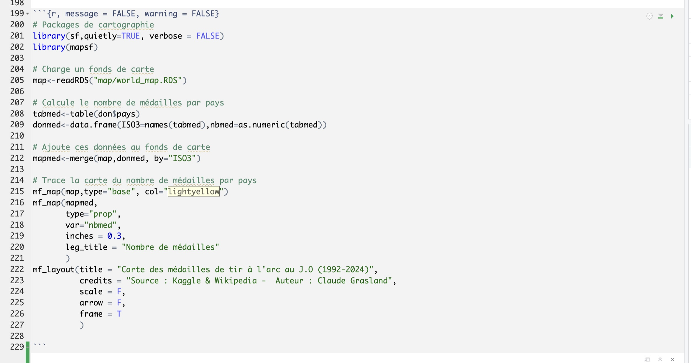
```

Et le résultat :

```{r, echo=FALSE, out.width="700px"}
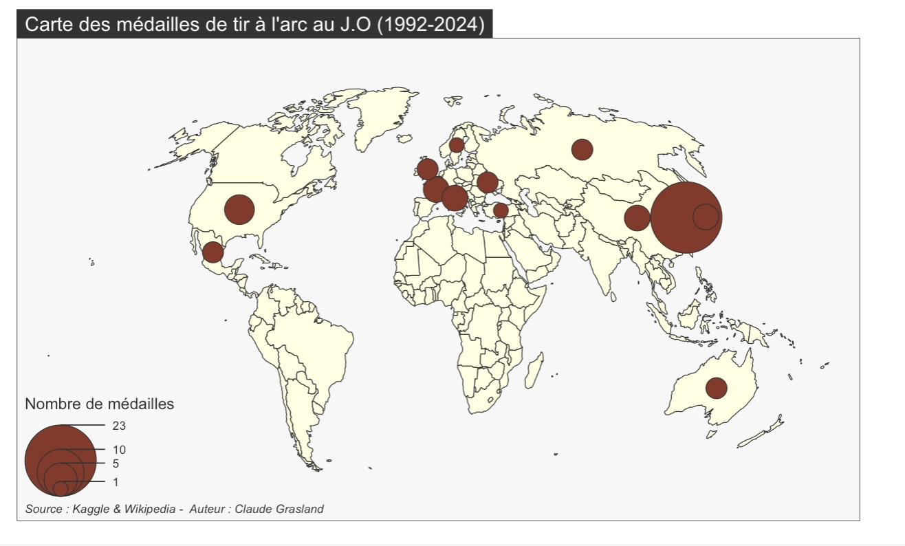
```

## Diapos Rmd : Power Point killer

Lorsque l'on crée un fichier Markdown, on peut décider qu'il ne s'agit pas d'un document mais d'une présentation et opter pour l'un des deux modes par défaut appelés `slidy` et `ioslides`.

```{r, echo = FALSE}
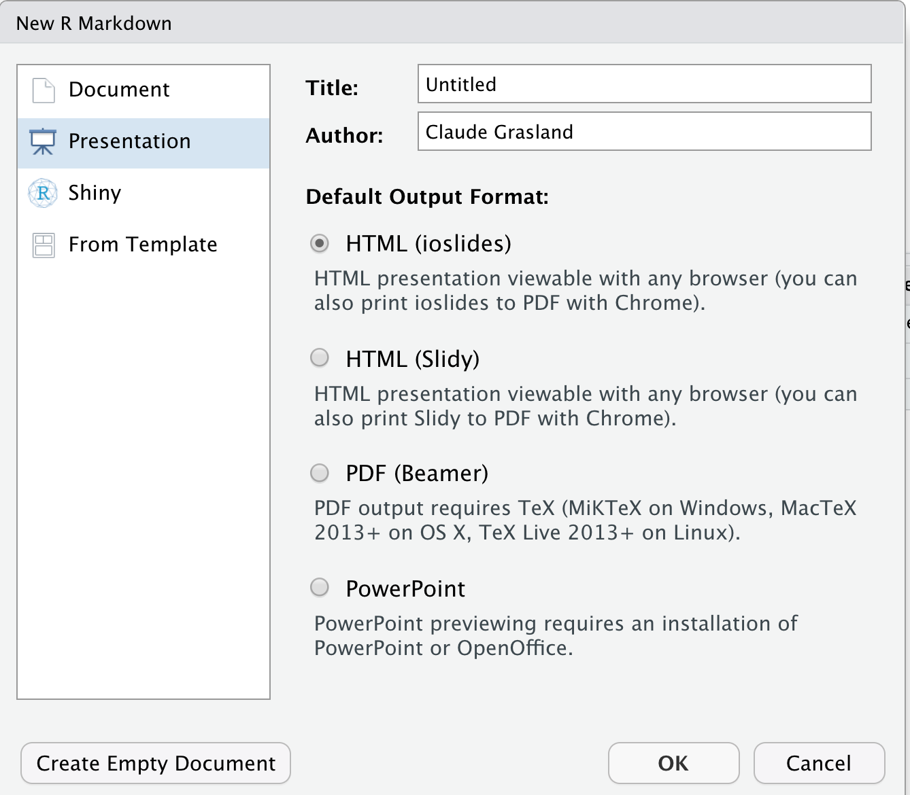
```

On peut ensuite créer un diaporama en donnant un titre général et en séparant chaque diapo par un titre de niveau 2 correspondant à des lignes débutant par `##` comme dans l'exemple ci-dessous :

```{r, echo = FALSE}
knitr::include_graphics("resources/figures/diapo_prog.png")
```

Il ne reste plus qu'à compiler le programme avec l'icône `Knit` (pelotte de laine) pour générer un document .html en forme de dipositives. 

```{r, echo = FALSE, fig.width=3}
knitr::include_graphics("resources/figures/diapo1.png")
knitr::include_graphics("resources/figures/diapo2.png")
knitr::include_graphics("resources/figures/diapo3.png")
```


## En résumé


```{block, type='rmdnote'}
R est un `Excel killer` mais aussi un `Word killer` voire un `Power point killer`...  Adopter R peut nuire gravement à vos habitudes antérieures de travail.

```
