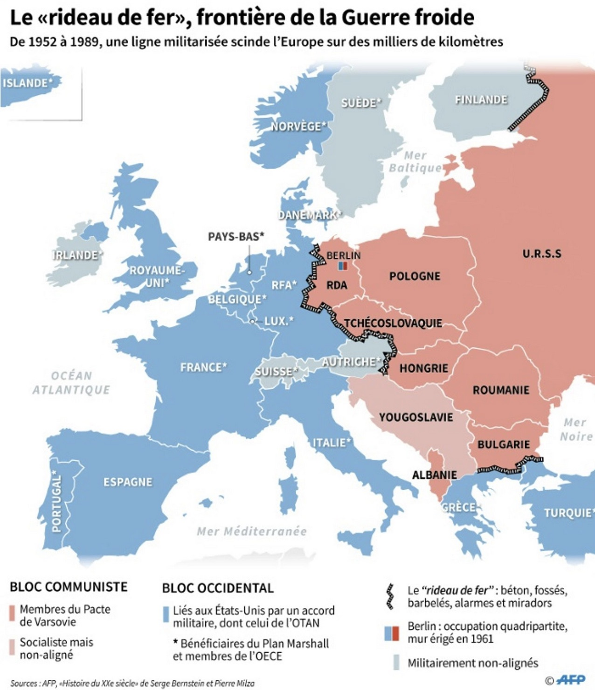

# R-Base


```{r, echo = FALSE}
library(knitr)

```


- **Mise en place** : Télécharger le [dossier exo3](https://github.com/ClaudeGrasland/bivaR/raw/main/resources/exos/exo3.zip) et décompressez le sur votre ordinateur. Puis ouvrez le projet R `exo3.Rproj` dans Rstudio.

L'objectif de ce chapitre assez long est d'apprendre aux étudiants les bases du langage R dans sa version originale que l'on appelle `R-Base` dans la mesure où elle ne fait appel à aucun package et constitue le noyau central du langage. Ce chapitre se compose de deux parties complémentaires :


1. **La manipulation des tableaux de données** : c'est-à-dire à la fois l'importation, le recodage éventuel des variables et la correction de leur type, la sélection de lignes ou de colonnes pour créer des sous-tableaux.
2. **L'exploration statistique univariée** : c'est-à-dire le calcul de résumés simples d'une variable à l'aide de paramètres statistiques (valeurs centrales, dispersion) et la production de graphiques élémentaires. 

Pour rendre l'apprentissage moins austère, nous avons choisi un tableau de données original qui présente les principales caractéristiques de 25 pays européens en 1989, à la veille de la chute du Mur de Berlin. Plutôt que de se contenter apprendre par coeur des commandes R (ce qu'il faudra faire, évidemment), les étudiants seront amenés à construire un véritable rapport sur la situation économique, démographique et sociale de l'Europe en 1989, ce qui les amènera à renforcer leur pratique du R markdown. Par ailleurs, on organisera un débat entre les étudiants qui seront placés en deux groupes rivaux chargés de défendre respectivement les pays socialistes et lespays capitalistes. A chaque groupe de montrer que son système politique est le meilleur ...


## Tableaux

### Importation

#### Localisation des fichiers

- La commande `getwd()` permet de connaître la position du répertoire courant. Si vous avez ouvert un projet (ce qui est vivement recommandé) la localisation est l'emplacement du fichier .Rproj.

```{r}
getwd() 
```


- La commande `list.files()` permet d'examiner le contenu du répertoire courant

```{r}
list.files()
```


#### Chargement d'un fichier texte

- Avec la souris

Cliquer sur les menus déroulants **File/Import Dataset/From text (base)** puis suivre le menu

```{r, echo = FALSE}
library(knitr)
knitr::include_graphics("resources/figures/img001.jpeg")
```


- Avec des lignes de code

On utilise par exemple la fonction `read.table()` en précisant les paramètres utiles :

```{r}
euro1988 <- read.table(file = "resources/data/europe88/euro1988.csv", # nom du fichier et chemin d'accès
                  sep = ";",                     # séparateur (ici, des points-virgule)
                  header = TRUE,                 # ligne d'en-tête avec le nom des variables
                  encoding="UTF-8")              # encodage adapté au français
```


#### Dimensions d'un tableau

- La fonction `dim()` fournit les dimensions d'un tableau

```{r}
dim(euro1988)
```

- La fonction `class()` fournit le type d'un tableau

```{r}
class(euro1988)
```


#### Visualisation du contenu d'un tableau

- Premières lignes avec `head()`

```{r}
head(euro1988)         # Affiche par défaut les 6 premières lignes
```

- Dernières lignes avec `tail()`

```{r}
tail(euro1988,2)         # Affiche les 2 dernières lignes
```


#### Verification des variables

- Vérifie le type avec `str()`

```{r}
str(euro1988)
```


- Recode avec les fonctions `as.xxx()`

```{r}
euro1988$BLOC<-as.factor(euro1988$PAYS)
str(euro1988)
```


#### Résume  du tableau

La fonction `summary()` donne un aperçu général des variables

```{r}
summary(euro1988)
```


### Transformations


#### Copie intégrale 

Elle s'effectue avec l'opérateur  `<-`

```{r}
tab<-euro1988
dim(tab)
head(tab,2)
tail(tab,2)
```


#### Sélection de lignes

On utilise la syntaxe `tab2<-tab[conditions , ]` avec  les opérateurs logiques :

   - égal à **==**
   - différent de **!=**
   - supérieur à  **>** 
   - inférieur à  **<** 


- Exemple de sélection des pays socialistes

```{r}
tabsoc<-euro1988[euro1988$BLOC=="Soc",]
tabsoc
```

- Exemple de sélection des pays non socialistes

```{r}
tabcap<-euro1988[euro1988$BLOC!="Soc",]
tabcap
```


- Exemple de sélection des pays de plus 10 millions d'habitant

```{r}
tabbig<-euro1988[euro1988$POP>20,]
tabbig
```


- Exemple de sélection des pays socialistes de plus 20 millions d'habitant (on mélange deux conditions avec l'opérateur `&`)

```{r}
tabsocbig<-euro1988[euro1988$BLOC=="Soc" & euro1988$POP>20,]
tabsocbig
```


#### Sélection de colonnes

On utilise la syntaxe `tab2<-tab[  ,  liste ]` avec différentes  syntaxes pour les listes de variables :


- Sélection nominale

```{r}
tab<-euro1988[,c("PAYS", "BLOC", "PNB", "TMI","POP")]
head(tab,2)
```

- Sélection de positions 

```{r}
tab<-euro1988[,c(1:4, 13)]
head(tab,2)
```


#### Sélection simultanée de lignes et colonnes

On utilise la syntaxe `tab2<-tab[ conditions ,  liste]` 

- Exemple : PNB et BLOC des pays de moins de 5 millions d'habitant

```{r}
tab<-euro1988[euro1988$POP<5, c("PAYS","BLOC","POP","PNB")]
tab
```


### Extractions

#### Extraction d'une Variable = Vecteur

- Solution n°1 : utilisation de l'opérateur `$`

```{r}
myvar<-euro1988$POP
str(myvar)
mean(myvar)
```

-Solution n°2 : utilisation de  `[ , ]`

```{r}
myvar<-euro1988[,13]
str(myvar)
mean(myvar)
```


#### Création d'une matrice 

On sélectionne les lignes et les colonnes puis on convertit en matrice avec l'instruction `as.matrix()`. Attention, les variables doivent être de même type (toutes numériques ou toutes caractère ou ...), sinon R effectue une conversion forcée. 

-  **Exemple 1 : création d'une matrice de corrélation**

On commence par extraire trois variables du tableau pour en faire une matrice :

```{r}
mymat<-euro1988[,c("PNB","TMI","FEC")]
row.names(mymat)<-euro1988$PAYS  # facultatif : donne le nom des lignes
str(mymat)
mymat<-as.matrix(mymat)
str(mymat)
```


Puis on applique la fonction `cor()` à cette matrice pour en faire une matrice de corrélation ; 

```{r}
mycor<-cor(mymat)
mycor
str(mycor)
```


- **Exemple 2 : Création d'une matrice de distance**

On commence par extraire les coordonnées (X,Y) sous forme de matrice

```{r}
matcoo<-as.matrix(euro1988[,c("X","Y")])
row.names(matcoo)<-euro1988$PAYS  # facultatif : donne le nom des lignes
str(matcoo)
head(matcoo)
```


Puis on transforme ces coordonnées en distance à l'aide de la fonction `dist()`

```{r}
matdis<-as.matrix(dist(matcoo))
str(matdis)
matdis[1:10,1:5]
```


Et on calcule le pays le plus proche de tous les autres à l'aide de la fonction `apply()` (qu'on verra ultérieurement dans un autre chapitre)

```{r}
mean(matdis)
access<-apply(matdis, FUN=mean,1)
access<-access[order(access)]
round(access,0)
```


## En résumé


```{block, type='rmdnote'}

```


