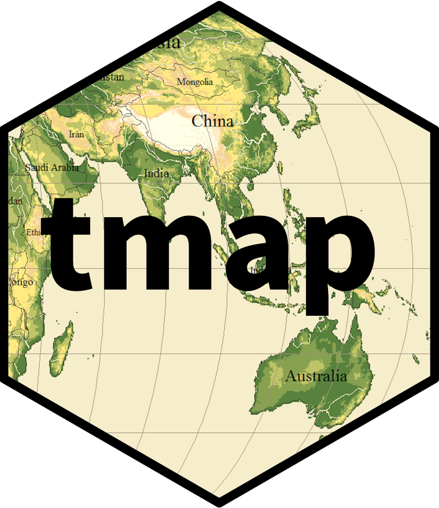

# Cartographie avec tmap (2024)


```{r, echo = FALSE, warning=F,message=F}
knitr::opts_chunk$set(echo = TRUE,warning=F,message = F)
library(knitr)
library(sf)
library(tmap)

```


- **Mise en place** : Télécharger le [dossier exo8](https://github.com/ClaudeGrasland/bivaR/raw/main/resources/exos/exo8.zip) et décompressez le sur votre ordinateur. Puis ouvrez le projet R `exo8.Rproj` dans Rstudio.


## Introduction


### Cartographie dans R

Il est très facile de faire des cartes dans R. Le package cental est **sf** (*spatial features*) qui permet d'importer, exporter, transformer des fonds de cartes. Toutefois ce package sf a des fonctionalités limitées en matière de représentations finales de documents et son rôle est davantage la gestion des données spatiales que leur représentation. On utilisera donc des packages spécialisés comme :

- mapsf
- ggmap
- tmap
- mapview
- etc.

On a choisi ici d'utiliser **tmap** car c'est l'un des plus simples pour les débutants et sa syntaxe est très proche de celle de **ggplot2**

Les principales commandes sont résumées [ici](https://cran.r-project.org/web/packages/tmap/vignettes/tmap-getstarted.html) ou bien [là](http://cran.nexr.com/web/packages/tmap/vignettes/tmap-nutshell.html)


## Données statistiques


### Chargement du fichier

On charge un fichier statistique portant sur les élections européennes de 2024 par circonscriptions en France et on sélectionne quelques variables

```{r }
don<-readRDS("resources/data/elect2024/elec2024_circ.RDS")
don$urb3 <- cut(don$loc_urb, breaks=c(-1,50,90,101))
levels(don$urb3) <- c("rural (<50%) ","mixte (50-90%)","urbain (>90%)")
don$tx_abs <- 100*(don$INS-don$EXP)/don$INS
don<-don[,c("ID","code_reg","nom_reg", "INS","EXP", "urb3", "dip_supbac","tx_abs")]
kable(head(don))
```


### Dictionaire des variables

Nous n'utiliserons ici que quelques variables

- **ID**    : Code de la circonscription
- **code_reg** : code de la région
- **nom_reg** : nom de la région
- **INS** : nombre d'inscrits
- **EXP** : nombre de suffrages exprimés
- **urb3** : typologie des circonscriptions 
- **dip_supbac** : % actifs diplômés > bac
- **tx_abs** : taux d'abstention

---


### Résumé de l'ensemble du tableau

```{r}
summary(don)
```


## Données cartographiques

### Carte des circonscriptions

On importe en premier le fonds de carte des circonscriptions à l'aide de la commande `st_read()` du package **sf**. Ceci permet de convertir le fichier shapefile (externe) en fichier sf (utilisable par R).

```{r}
library(sf)
map <- st_read("resources/data/elect2024/map_circ.shp")
class(map)
head(map)
```

On remarque que ce fichier comporte une colonne spéciale appelée `geometry`. C'est celle qui contient le fonds de carte, que l'on peut visualiser avec la fonction plot() :

```{r}
par(mfrow=c(1,1), mar=c(0,0,3,0))
plot(map$geometry)
title("Circonscriptions")
```

### Autres fonds de carte

Nous chargeons également deux autres fonds de carte présentant les déparements et les régions.

```{r}
map_dept  <- st_read("resources/data/elect2024/map_dept.shp")
map_reg  <- st_read("resources/data/elect2024/map_reg.shp")
par(mfrow=c(1,2), mar=c(0,0,3,0))
plot(map_dept$geometry)
title("Départements")
plot(map_reg$geometry)
title("Régions")
```


## Jointure

Afin de représenter les variables contenues dans le tableau statsitique (don), il faut effectuer une jointure avec le fonds de carte (map) en trouvant une variable commune et en appliquant la fonction `merge()`. On retire les variables en double du fonds de carte

```{r}
mapdon <- merge(map[,1], don, by="ID")
```


### Extraction d'une région

Pour illustrer les fonctions de mapsf, nous allons sélectionner la région Bretagne

```{r}
mapdon_reg<-mapdon[mapdon$nom_reg=="BRETAGNE",]
plot(mapdon_reg$geometry)
title("Circonscriptions de Bretagne")
```

## Carte de repérage

La création d'une carte avec tmap se fait à l'aide de la fonction `tm_shape()` suivie de la fonction `tm_polygons()` que l'on relie par un opérateur `+`comme dans ggplot.

```{r}
tm_shape(mapdon_reg) +
  tm_polygons()
```

On peut ajouter un texte à l'aide de `tm_text()` et un titre à l'aide de `tm_layout()`.

```{r}
tm_shape(mapdon_reg) +
  tm_polygons() + 
   tm_text("ID") + 
    tm_layout(title = "Circonscriptions de Bretagne")

```

Toute une série d'options permettent d'améliorer la carte.

```{r}
tm_shape(mapdon_reg) +
  tm_polygons(col = "lightyellow") + 
   tm_text("ID",
           size = 0.7,
           col= "red") + 
    tm_layout(main.title = "Circonscriptions de Bretagne",
              bg.color = "lightblue")
```

## Carte d'une variable qualitative

Il suffit que la varaible qualitative soit bien de type *factor* ou *character* et tmap va automatiquement utiliser la solution adaptée. On donne juste le nom de la variable à représenter dans `tm_polygons()` .

```{r}
tm_shape(mapdon_reg,) +
  tm_polygons("urb3") 
```

On peut ensuite ajouter un habillage comme on l'a vu précédemment et modifier les paramètres.

```{r}
tm_shape(mapdon_reg,) +
  tm_polygons("urb3")  +
  tm_text("ID",
           size = 0.7,
           col= "black") + 
    tm_layout(main.title = "Typologie Urbain-Rural",
              title.size = 1.2,)
```

## Carte d'une variable quantitative de taux

Lorsqu'un phénomène correspond à un taux concernant une population répartie dans l'ensemble de l'espace, il suffit d'indiquer celle-ci dans tm_polygons() pour la visualiser.


```{r}
tm_shape(mapdon_reg,) +
  tm_polygons("tx_abs") 
```

L'habillage se fait sans difficultés. De nombreuses options permettent de modifier les classes, les couleurs, etc.

```{r}
tm_shape(mapdon_reg,) +
  tm_polygons("tx_abs")  +
  tm_text("ID",
           size = 0.7,
           col= "black") + 
    tm_layout(main.title = "Taux d'abstention aux européennes de 2024",
              title.size = 1.2,)
```


## Carte d'une variable quantitative de stock

Dans le cas où la variable quantitative décrit des stocks que l'on peut additionner il faut changer de représentation et utilise des figurés proportionnels à l'aide de la fonction `tm_bubbles()` 

```{r}
tm_shape(mapdon_reg,) +
  tm_polygons() +
   tm_bubbles (size = "INS", col="red") +
      tm_layout(main.title = "Nombre de suffrages exprimés par circonscription",
              title.size = 1.2,)
```

## Combinaison de cartes quantitatives de stock et de taux

Dans la mesure où un taux est en général le rapport de deux stocks, il est intéressant de représenter simultanément un tauxw et son dénominateur. Par exemple le taux d'abstention ert le nombre d'inscrits :

```{r}
tm_shape(mapdon_reg,) +
  tm_polygons()  +
  tm_bubbles(size="INS",col="tx_abs")+
    tm_layout(main.title = "Taux d'abstention et nombre d'inscrits",
              title.size = 1.2,
              legend.outside = T)
```

## Superposition de cartes

On peut facilement superposer des cartes de types différents en les ajoutant les unes après les autres. Par exemple :

```{r}
tm_shape(mapdon_reg,) +
  tm_polygons("urb3")  + 
  tm_bubbles(size="INS",col="tx_abs")+
    tm_layout(main.title = "Taux d'abstention selon le milieu urbain ou rural",
              title.size = 1.2,
              legend.outside = T)

```

## Juxtaposition de cartes

Une façon très simple consiste à donner plusieurs variables dans la fonction `tm_polygons()` puis à spécifier la disposition des deux cartes avec `tm_facets()`.

```{r}
# Dispossition verticale
tm_shape(mapdon_reg) +
  tm_polygons(c("tx_abs","dip_supbac")) +
  tm_facets(ncol = 1)
 
# Dispossition horizontale
tm_shape(mapdon_reg) +
  tm_polygons(c("tx_abs","dip_supbac")) +
  tm_facets(ncol = 2)
```

## Pour en savoir plus

Nous nous sommes limité ici au bases élémentaires de la cartographie. Il y a évidemment beaucoup plus à apprendre pour connaître la manière de faire une bonne carte. 