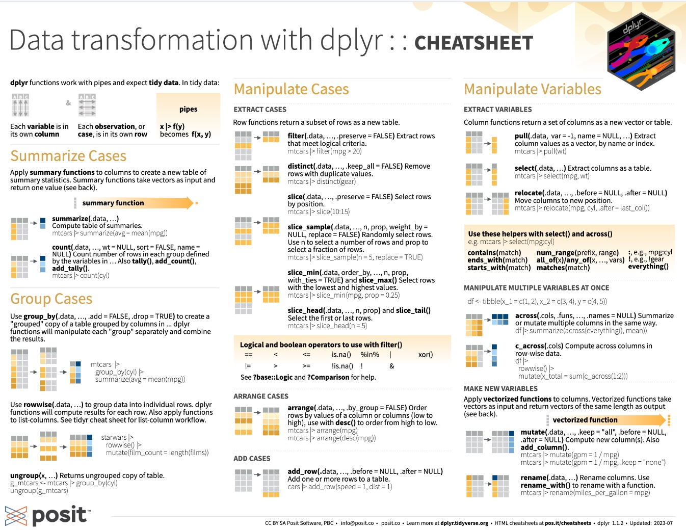

# Initiation à tidyverse


```{r, echo = FALSE, warning=F,message=F}
knitr::opts_chunk$set(echo = TRUE,warning=F,message = F)
library(knitr)
library(ggplot2,quiet=T)
library(dplyr,quiet=T)
```


- **Mise en place** : Télécharger le [dossier exo_dvf](https://github.com/ClaudeGrasland/bivaR/raw/main/resources/exos/exo_dvf.zip) et décompressez le sur votre ordinateur. Puis ouvrez le projet R `exo.Rproj` dans Rstudio.


## Introduction


### Un nouvel empire ? 

Le package **tidyverse** mis au point par les auteurs de R Studio est une collection de packages R qui se présente comme un **nouveau langage** permettant le traitement intégré des données selon une chaîne qui part de l'importation (*readr*) et de la mise en forme (*tidyr*) pour passer ensuite aux transformations(*dplyr*, *broom*), à la visualisation statistique (*ggplot2*) ou cartographique (*ggmap*), à la modélisation et enfin la restitution sous forme de documents (*Rmarkdown*).

```{r, echo=FALSE}
    knitr::include_graphics("resources/figures/tidyverse-package-workflow.png",dpi = 500)
```

La liste de package présentée dans la figure ci-dessus n'est d'ailleurs pas exhaustive car il existe des packages plus spécialisés dans l'analyse et le recodage des variables catégorielles (*forcats*) ou temporelles (*lubridate*), l'analyse de données textuelles (*stringr*), l'étude de données d'enquête (*haven*). En dehors de tidyverse proprement dit, les auteurs de ce package ont mis au point des outils d'analye textuelle (*tidytext*), de création de site web (*shiny*) qui s'inscrivent dans la même philosophie. 

```{r, echo=FALSE}
    knitr::include_graphics("resources/figures/tidyverse_website.png")
```

Bref, tidyverse se présente comme un **nouvel empire**  qui remplacerait les vieux packages R destinés à tomber dans les poubelles de l'histoire et constituerait l'[outil ultime de la science des données](https://www.tidyverse.org/)...

### Pour une utilisation sélective

Les adhérents de la philosophie tidyverse ont donc pour pratique de charger d'emblée le superpackage *tidyverse* et d'inclure de ce fait l'ensemble de ces composantes qu'elles soient utiles ou non à l'analyse, ce qui ne manque pas de créer des conflits avec d'autres packages disponibles dans R : 


```{r, eval=FALSE}
# Ne pas executer !
library(tidyverse)
```

L'auteur de ces lignes et beaucoup de chercheurs en sciences des données ne partagent cependant pas l'enthousiasme des auteurs de tidyverse et émettent plusieurs réserves.

- tidyverse n'est pas un très bon logiciel de statistique comparativement à d'autres packages tels que *car* (pour la régression), *survey* ou *questionr* (pour les analyses d'enquêtes).
- tidyverse n'est pas le meilleur package pour des représentation cartographiques et il existe d'autres packages plus effficaces tels que *tmap*, *leaflet*, *mapsf*, ...
- tidyverse charge inutilement la mémoire de l'ordinateure packages pas toujours utiles aux objectifs que l'on s'est donné.
- tidyverse n'est pas le plus performant pour la gestion de très grandes masses de données comparativement au package *data.table*
- tidyverse ne fait souvent que dupliquer des packages existants
- ...

Bref, il semble préférable d'utiliser au cas par cas les composantes de tidverse et de ne charger que celles dont on a réellement l'utilité et pour lesquelles les auteurs ont réellement apporter une innovation majeure. Deux packages relèvent clairement de cette catégorie : *dplyr* et *ggplot2*. C'est donc uniquement ces deux packages que nous allons utiliser ici en insistant sur leurs qualités et leur complémentarité.

```{r}
library(dplyr)
library(ggplot2)
```


### Jeu de données


On charge un fichier sauvegardé au format .RDS appelé *DSTM1_2023_V2.RDS* 

```{r }
base<-readRDS("resources/data/dvf/dm/DSTM1_2023_V2.RDS")
base<-as.data.frame(base)
head(base)
```


#### Contenu du fichier

Ce dossier est une version simplifiée des *Demandes de Valeurs Foncières* et contient un échantillon des ventes de maisons  ou d'appartements effectués dans un ensemble de communes d'Ile de France caractérisées par la présence d'un volume important de maisons et d'appartement. 

**Sources** : Ces données sont disponibles sur le site opendatasoft sous l'appellation ["Demandes de valeurs foncières géoloalisées"](https://public.opendatasoft.com/explore/dataset/buildingref-france-demande-de-valeurs-foncieres-geolocalisee-millesime/information/)


La liste des variables est la suivante :


- **com_code** : code INSEE de la commune où a eu lieu la transaction
- **com_nom** : nom de la commune où a eu lieu la transaction
- **ann** : année de la transcation
- **type** : type de bien vendu (maison ou appartement)
- **prix** : prix de vente du bien
- **surf** : surface habitable du logement
- **nbp** : nombre de pièces du logement
- **X** : cordonnées projetées de longitude
- **Y** : coordonnées projetées de latitude
- **dist_gare** : distance à la gare la plus proche en mètres


```{r}
summary(base)
```


## Manipuler avec dplyr


Nous allons passer rapidement en revue quelques commandes de base de *dplyr* à travers des exemples précis d'application.On commence par charger le package `dlyr` qui est une partie de l'univers `tidyverse` mais que l'on peut utiliser indépendamment du reste de l'empire d'Hadley Wickham...

```{r}
library(dplyr)

```


### **filter()** 

La commande `filter()` permet de sélectionner des lignes. Deux syntaxes sont possibles :

- `filter(`*tableau, condition1, condition2, ...*`)`
- *tableau* `%>% filter(`}*condition1, condition2, ..*.`)`

On préfrera la seconde syntaxe qui évite de mélanger dans la parenthèse le nom du tableau et les conditions de sélection. La fonction `%>%` est un *pipeline* (en abrégé '*pipe*') qui peut se traduire par '*et ensuite*' lorsque l'on enchaîne une série d'instruction.


Par exemple, si on veut sélectionner la commune de St-Maur-des-Fossés dont le code est 94068 on pourra écrire le programme suivant


```{r}
# Solution R-Base
don<-base[base$com_code=="94068",]
head(don,3)

#Solution dplyr 
don<-base %>% filter(com_code=="94068")
head(don,3)
```

A première vue il n'y a pas beaucoup de différence entre R-Base et dplyr. Mais l'avantage de ce dernier apparaît mieux lorsque l'on veut effectuer une solution selon plusieurs critères. Par exemple, supposons qu'on veuille sélectionner les ventes de maison de 80 à 120 m2 à Saint-Maur des fossés en 2020 : 

```{r}
# Solution R-Base
don<-base[base$com_code=="94068" & 
            base$type=="Maison" & 
            base$ann == 2020 & 
            base$sup >= 80 &
            base$sup <= 120,]
head(don,3)

#Solution dplyr 
don<-base %>% filter(com_code=="94068",
                      type=="Maison",
                      ann == 2020, 
                      sup >= 80,
                      sup <= 120)
head(don,3)
```

Le code est désormais beaucoup plus léger et beaucoup plus clair dans le cas de dplyr, surtout si l'on procède à une indentation des conditions. 

### **select()** 

La commande `select()` permet de choisir des variables c'est-à-dire des colonnes dans un tableau. Supposons à titre d'exemple que l'on veuille créer un tableau ne contenant que les variables com_nom, type, prix et surface.


```{r}
# Solution R-Base
don<-base[,c("com_nom", "type","prix","sup")]
head(don,3)

#Solution dplyr 
don<-base %>% select(com_nom, type, prix, sup)
head(don,3)
```

La principale différence entre les deux écritures est l'absence d'apostrophe "" dans la liste du nom des variables utilisées par select() ce qui est tout de même un gain de temps précieux. 

On peut procéder à des sélections par numéro de colonnes et on peut supprimer des variables avec l'opérateur "-". Par exemple, pour retirer les variables X et Y on a deux écritures possibles en dplyr


```{r}
# Solution R-Base
don<-base[,c(1:7,10)]
head(don,3)

#Solution dplyr n°1
don<-base %>% select(1:7,10)
head(don,3)

#Solution dplyr n°2
don<-base %>% select(-X,-Y)
head(don,3)
```


### **mutate()** 

La commande `mutate()` permet de créer de nouvelles variables ou de modifier des variables existantes. Supposons par exemple qu'on veuille créer un tableau contenant pour la commune de Saint-Maur une variable prix au m2 et une variable distance à la gare en km.


```{r}
# Solution R-Base
don<-base[base$com_code==94068,]
don$prixm2<-don$prix/don$sup
don$dist_gare<-don$dist_gare/1000
don<-don[,c("prixm2", "dist_gare")]
head(don,3)

#Solution dplyr n°1
don<-base %>% filter(com_code==94068) %>%              # sélection de Saint-Maur
              mutate(prixm2 = prix/sup,                # création du prix au m2
                     dist_gare = dist_gare/1000)%>%    # conversion de la distance en km
              select(prixm2,dist_gare)                 # sélection des variables utiles
head(don,3)

```

Nous voyons ici l'intérêt du pipeline `%>%` qui permet d'enchaîner de façon simple les différentes opérations effectuées respectivement par chacune des fonctions. La lecture du programme est beaucoup plus naturelle que dans le cas de R-Base


### arrange()

La commande `mutate()` permet enfin de trier le tableau selon une ou plusieurs clés de tri. Reprenons par exemple le programme précédent et essayons de trier les résultats en fonction de la distance à la gare.

```{r}
# Solution R-Base
don <- base[base$com_code==94068,]
don$prixm2 <- don$prix/don$sup
don$dist_gare <- don$dist_gare/1000
don <- don[,c("prixm2", "dist_gare")]
don <- don[order(don$dist_gare),]
head(don,3)
tail(don,3)

#Solution dplyr n°1
don<-base %>% filter(com_code==94068) %>%              # sélection de Saint-Maur
              mutate(prixm2 = prix/sup,                # création du prix au m2
                     dist_gare = dist_gare/1000)%>%    # conversion de la distance en km
              select(prixm2,dist_gare) %>%             # sélection des variables utiles
              arrange(dist_gare)
head(don,3)
tail(don,3)

```


## Visualiser avec ggplot2

On commence par charger le package `ggplot2` qui est une partie de l'univers `tidyverse` mais que l'on peut utiliser indépendamment du reste de l'empire d'Hadley Wickham...

```{r}
library(ggplot2)
knitr::include_graphics("resources/figures/ggplot2.jpeg")
```


### Les différentes étapes

- la commande **ggplot**(*data*) initie la création du graphique.
- la commande **aes()** qui est l'abrévation de *aesthetics* définit les paramètres généraux de l'ensemble du graphique et comporte en général 
  + **x =** variable liée à l'axe horizontal
  + **y=**  variable liée à l'axe vertical
  + **colour=** : variable définissant des groupes /  couleur
  + **shape=** : variable définissant des groupes /  forme
- la commande **geom_xxx** crée un graphique de type xxx 
- les commandes additionnelles **scale_xxx** précisent les axes
- la commande additionelle **facet_xxx** partitionne la figure en plusieurs
- la commande **theme_xxx** retouche l'ensemble des paramètres de couleur, police, épaisseur

N.B. Toutes les étapes ci-dessus ne sont pas obligatoires. 


### La figure à réaliser

Comment réaliser la figure ci-dessous ?

```{r exo1bis, include = TRUE, echo=FALSE}
sel<-base %>% filter(com_code==94068) %>%
              mutate(periode = as.factor(ann>2019))%>%
              select(periode, type, prix, sup)
levels(sel$periode)<-c("Pre-covid (2017-19)","Covid (2020-21)")

  ggplot(sel) +
  aes(x = sup) +
  aes(y = prix) +
  geom_point() +
  scale_x_continuous(name="Surface du logement")+
  scale_y_continuous(name="Prix de vente")+
  facet_wrap(vars(type, periode),ncol= 2)+
  geom_smooth(method="lm") +
  ggtitle(label = "Prix et surface des logements à Saint-Maur-des Fossés en 2020",
          subtitle = "Source : DVF ") +
  theme_light()


```

### La construction pas à pas 

On commence par préparer le tableau de données avec dplyr : 

```{r}
sel<-base %>% filter(com_code==94068) %>%
              mutate(periode = as.factor(ann>2019))%>%
              select(periode, type, prix, sup, nbp)
levels(sel$periode)<-c("Pre-covid (2017-19)","Covid (2020-21)")
head(sel)
                        
  
```


On définit le tableau de données avec `ggplot()` et les variables principales avec `aes()`

```{r }

  ggplot(sel) +
  aes(x = sup) +
  aes(y = prix) +
  aes(col = type)

```


On ajoute le type principal du graphique avec la commande `geom_point()`

```{r }

  ggplot(sel) +
  aes(x = sup) +
  aes(y = prix) +
  geom_point() 
```


On retouche les axes horizontaux et verticaux en les passant en logarithme et en leur donnant un titre. 

```{r }

  ggplot(sel) +
  aes(x = sup) +
  aes(y = prix) +
  geom_point() +
  scale_x_continuous(name="Surface du logement")+
  scale_y_continuous(name="Prix de vente")

 

```

On segmente le graphique en facettes selon une ou plusieurs variables avec `facet_wrap()`. Du coup, on retire ces variables de l'esthétique générale : 

```{r }

  ggplot(sel) +
  aes(x = sup) +
  aes(y = prix) +
  geom_point() +
  scale_x_continuous(name="Surface du logement")+
  scale_y_continuous(name="Prix de vente")+
  facet_wrap(vars(type, periode),ncol= 2)


```

On ajoute dans chaque facette une droite de tendance et son intervalle de confiance avec `geom_smooth()`. On précise *method="lm"* pour avoir une droite et non pas une courbe

```{r }

  ggplot(sel) +
  aes(x = sup) +
  aes(y = prix) +
  geom_point() +
  scale_x_continuous(name="Surface du logement")+
  scale_y_continuous(name="Prix de vente")+
  facet_wrap(vars(type, periode),ncol= 2)
  geom_smooth(method="lm") 


```

Onajoute un titre principal avec `ggtitle()` et on retouche l'ensemble de l'apparence avec `theme_light()`.

```{r }

  ggplot(sel) +
  aes(x = sup) +
  aes(y = prix) +
  geom_point() +
  scale_x_continuous(name="Surface du logement")+
  scale_y_continuous(name="Prix de vente")+
  facet_wrap(vars(type, periode),ncol= 2)+
  geom_smooth(method="lm") +
  ggtitle(label = "Ventes de logements à Saint-Maur (2017-2021)",
          subtitle = "Source : DVF ") +
  theme_light()


```

### Comparaison avec R-Base

- La principale différence réside dans la **construction séquentielle** de la figure avec l'opérateur **+**. A tout moment on peut sauvegarder la figure au cours d'une des étapes décrites dans l'exemple. On parle de **pipeline** pour ce type de programme que l'on retrouve dans la manipulation de données avec **tidyverse** et **dplyr**.

- La seconde différence réside dans la **production rapide** d'une figure de qualité graphique acceptable sans avoir besoin de spécifier les paramètres **par()** de R-Base. 

- Au total, ggplot2 s'impose actuellement comme un **standard mondial** autour duquel se greffent d'autres applications. Par exemple, on peut rendre interactif un graphique ggplot() en le couplant avec **plotly()**.

- Mais ... ggplot2 est **beaucoup moins simple** qu'il n'y paraît de prime abord. Et on peut facilement s'arracher les cheveux sur certaines commandes !


### Attention ! Paramètres aes() locaux et globaux

Une des plus grandes difficultés que l'on rencontre dans ggplot() est **la manipulation du paramètre aes()** qui peut renvoyer :  

- soit à des **paramètres globaux** s'ils apparaissent dans le ggplot initial ou dans des lignes de codes isolées
- soit à des **paramètres locaux**, s'ils apparaissent à l'intérieur d'une fonction geom().

Deux exemples rapides pour bien comprendre 


- **type est un paramètre global** : dans ce cas il s'applique à toutes les commandes qui suivent. Il y aura donc **deux** droites de régression générées par geom_smooth

```{r}
ggplot(sel, aes(x = sup, y = prix, color = type)) +
geom_point() +
geom_smooth(method="lm")
```


- **type est un paramètre local de geom_point()** : dans ce cas il n'aura pas d'effet sur geom_smooth() qui va générer **une** seule droite de régression.

```{r, echo=TRUE}
ggplot(sel, aes(x = sup, y = prix)) +
geom_point(aes(color=type)) +
geom_smooth(method="lm")
```


## Comparaison R-Base / Ggplot2

### X discrète


#### barplot (R-base)


```{r }
barplot(table(sel$type), col = c("blue", "red"),
        xlab="Type de logement", ylab = "effectif")
```

#### geom_bar (ggplot2)


```{r }
# ggplot
ggplot(sel) +
  aes(x =type) +
  geom_bar(fill = c("blue","red"))+
  scale_x_discrete(name="Type de logement")+
  scale_y_continuous(name="effectif")


```


### X quantitative continue


#### hist (R-base)


```{r }
sel2<-sel[sel$type=="Maison",]
hist(sel2$prix,breaks = 15,
     col = "lightyellow",
     border = "blue",
     xlab="Prix de vente",
     ylab = "Nombre de ventes",
     main = "Ventes de maison")
```


#### geom_histogram (ggplot2)

```{r }
# On démarre par une ligne de tidyverse ...
sel %>%  filter(type=="Maison") %>%
#  ... en on embraye sur ggplot2 
  ggplot() +
  aes(x =prix) + 
# Appel de la fonction principale  
  geom_histogram( bins = 15,     
                 fill="lightyellow",
                 col="blue" 
                 ) +   
# Retouche de l'échelle
 scale_x_continuous( name = "Prix de vente") + 
 scale_y_continuous(name = "Nombre de ventes")+
# Ajout du titre 
 ggtitle("Ventes de logements à Saint-Maur (2017-2021)")


```


### X et Y quantitatives continues


#### plot (R-base)


```{r }

plot(x = sel$sup,
     y = sel$prix, 
     cex=0, 
     xlab="Surface",
     ylab="Prix de vente",
     main= "Ventes de maison")
points(x = sel$sup,
       y = sel$prix, 
       col=sel$type, 
       cex=sqrt(sel$nbp), 
       pch=19)
abline(lm(sel$prix~sel$sup), 
       col="blue",
       lwd=3)

```


#### geom_point (ggplot2)

```{r }

#  On définit les paramètres globaux 
  ggplot(sel, aes(x =sup, y=prix)) +
  
# On trace les points avec 
# des paramètres locaux
  geom_point(aes(color=type, 
                 size = nbp)) +
  
# On ajoute la droite de régression
  geom_smooth(method = "lm") +
  
# On ajoute les titres
  scale_x_continuous(name="surface") +
  scale_y_continuous(name="prix de vente") +
  ggtitle("Ventes de logements à Saint-Maur (2017-2021)")

```


### X quantitative continue et Y discrète


####  boxplot (R-base)


```{r }
sel2<-sel[(sel$type=="Maison"),]
sel2$SIZE<-as.factor(sel2$nbp)
#levels(don2$SIZE)<-c("1 ou 2", "1 ou 2", "3 ou 4", "3 ou 4", "5 ou 6", "5 ou 6")
boxplot(sel2$prix~sel2$SIZE, 
      col=rainbow(n=12, alpha=0.5),
       xlab="Nombre de pièces",
       ylab="Prix",
      main= "Ventes de logements à Saint-Maur (2017-2021)")

```


#### geom_boxplot (ggplot2)


```{r }
# On filtre le tableau et on change SIZE en factor
sel %>%  filter(type=="Maison") %>% 
         mutate(SIZE = as.factor(nbp)) %>%
  
# On définit les paramètres principaux
ggplot(aes(x= SIZE,y = prix)) +
  
# On ajoute la boxplot
geom_boxplot(aes(fill= SIZE)) +
  
  
# On ajoute les titres
  scale_x_discrete(name="Nombre de pièces") +
  scale_y_continuous(name="Prix de vente") +
  ggtitle("Ventes de logements à Saint-Maur (2017-2021)")

```


#### beanplot (R-base + package beanplot)


```{r }
par(bg="black",fg="white",col.lab ="white", col.axis ="white",col.main="white" )
sel2<-sel[(sel$type=="Maison"),]
sel2$SIZE<-as.factor(sel2$nbp)
#levels(don2$SIZE)<-c("1 ou 2", "1 ou 2", "3 ou 4", "3 ou 4", "5 ou 6", "5 ou 6")
library(beanplot)


beanplot(sel2$prix~sel2$SIZE, 
         col=c("lightyellow","red"),
       xlab="Nombre de pièces",
       ylab="Prix",
      main= "Ventes de logements à Saint-Maur (2017-2021)")

```


#### geom_violin (ggplot2)


```{r }
# On filtre le tableau et on change SIZE en factor
sel %>%  filter(type=="Maison") %>% 
         mutate(SIZE = as.factor(nbp)) %>%
  
# On définit les paramètres principaux
ggplot(aes(x= SIZE,y = prix)) +
  
# On ajoute la géométrie 
geom_violin(aes(fill= SIZE)) +
  
# On ajoute les titres
  scale_x_discrete(name="Nombre de pièces") +
  scale_y_continuous(name="Prix de vente") +
  ggtitle("Ventes de logements à Saint-Maur (2017-2021)") +

# On passe en thème "dark"
  theme_dark()


```


### Deux variables X et Y discrètes 


#### mosaicplot (R-base)


```{r}

mosaicplot(sel$periode~sel$type, 
      col=c("yellow","orange"),
       xlab="Année",
       ylab="Type de logement",
      main= "Ventes de logements à Saint-Maur (2017-2021)")

```


#### geom_bar (ggplot2) 


```{r}

  
# On définit les paramètres principaux
ggplot(sel,aes(x= periode, fill = type)) +
  

# On ajoute geom_bar
geom_bar() +

  
# On ajoute les titres
  scale_x_discrete(name="Année") +
  ggtitle("Ventes de logements à Saint-Maur (2017-2021)")


```


## Conclusion 


### R-base
- simple d'utilisation 
- peut être amélioré par des packages spécialisés
- permet de créer ses propres fonctions
- n'impose pas d'apprendre tidyverse

### ggplot2
- standard mondial du graphisme ... actuellement
- compatible avec la religion du tidyverse
- rédaction séquentielle très efficace
- mais apprentissage difficile (plusieurs semaines ...)

### Le meilleur des deux mondes ?
- ne pas hésiter à combiner les deux
- exportation facile des résultats dans les deux cas (pdf, jpeg, png, ...)

### plotly, un challenger sérieux de ggplot pour le web
- plotly crée des graphiques interactifs au format .html
- plotly peut convertir des documents ggplot
- plotly a une syntaxe proche de ggplot mais avec des fonctionnalités en plus
- plotly est multilangage (R, Python, ...)


